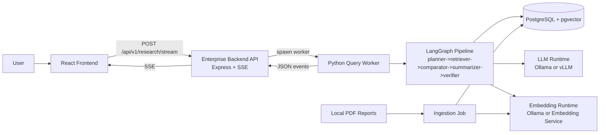
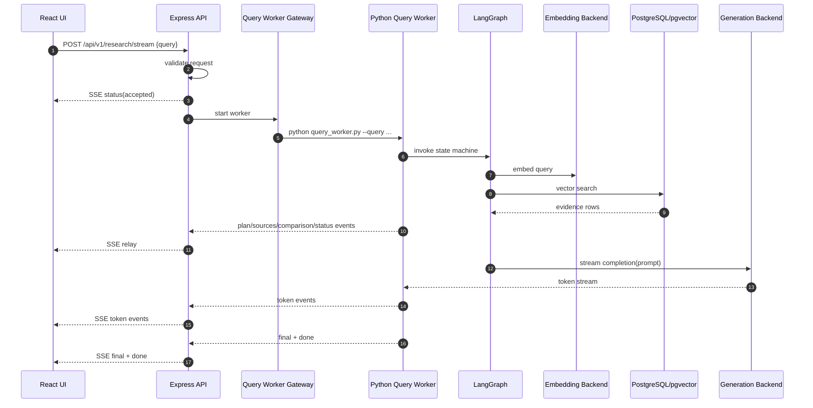

# Agentic Financial Research and Reporting System (Milestone 1)

Date: 2026-06-16
Project Name: Agentic Financial Research and Reporting System (AFRRS) 
Source Code Repository: https://github.com/Lashminarayanan/rag

## 1. Executive Summary

Milestone 1 establishes an end-to-end foundation for the Agentic Financial Research and Reporting System (AFRRS), enabling annual report ingestion, retrieval-ready vector storage, agentic query reasoning, and streaming of grounded, source-linked responses to the frontend.

The implementation now supports:

- Offline-first ingestion and retrieval over local annual reports.
- Enterprise backend API (`Express`) exposing health and streaming research endpoints.
- Python RAG worker pipeline (`LangGraph`) for planning, retrieval, comparison, summarization prompt-building, and verification.
- Vector retrieval stack with `PostgreSQL + pgvector`.
- Dual model backend strategy:
  - Local mode via `Ollama` for embeddings/generation.
  - GPU mode via `vLLM` + dedicated embedding microservice.
- React operations UI with live SSE updates for plan, evidence, status, comparison notes, token stream, and final output.
- Containerized deployment for both local and GPU environments.

## 2. Business Problem and Objectives

Financial analysts spend significant time manually locating facts, validating figures across sections, and preparing concise summaries from long annual reports. This workflow is repetitive, slow, and difficult to audit.

Project objectives for this milestone:

- Enable natural-language research over local report corpora.
- Return evidence-backed responses with citation-friendly context.
- Preserve explainability across planning, retrieval, comparison, and synthesis stages.
- Establish a secure offline-capable baseline suitable for enterprise hardening.

## 3. Workflow Understanding and Operating Challenges

Typical analyst workflow: collect reports, scan narrative disclosures, locate numerical metrics, compare periods or statements, verify interpretation, and draft final summary.

Current challenges addressed:

- Report length and density reduce analyst efficiency.
- Table and note discovery is difficult with manual search.
- Ungrounded summaries create trust and audit risks.
- Enterprise contexts require local/offline execution options.

Expected outcomes:

- Faster insight retrieval.
- Better traceability through evidence display.
- Reduced manual navigation effort.
- A modular architecture for future governance and quality controls.

## 4. Delivered Architecture and Capability

### Application/API Layer (`backend-enterprise`)

- API base path: `/api/v1`
- Endpoints:
  - `GET /api/v1/health`
  - `POST /api/v1/research/stream`
- Input validation with `zod` (`query`, optional `topK`, optional `mode`).
- SSE response initialization and event framing.
- Python query worker invocation through child process gateway.
- Real-time forwarding of worker stdout/stderr to SSE event stream.
- Graceful lifecycle handling (`error`, `close`, client disconnect kill).

### Orchestration & Reasoning Layer (`rag/app`)

- Query worker executes LangGraph state machine:
  - `planner` -> `retriever` -> `comparator` -> `summarizer` -> `verifier`.
- Planner generates explicit research steps.
- Retriever embeds query and performs vector similarity search in pgvector.
- Comparator emits cross-evidence consistency/table-priority notes.
- Summarizer builds grounded prompt with evidence snippets and citation expectations.
- Verifier flags whether evidence exists and emits warnings when none found.
- Generator streams answer tokens (via vLLM or Ollama) back to backend.

### Data Layer (`infra/sql`, `rag/app/repository.py`)

- `documents` table stores report-level metadata.
- `chunks` table stores chunk text, metadata JSONB, and `VECTOR(768)` embedding.
- Indexes:
  - `document_id` btree
  - metadata `GIN`
  - `ivfflat` cosine index for vector search
- Retrieval query computes similarity as:
  - `1 - (embedding <=> query_vector)`

### Ingestion Layer (`rag/app/ingest.py`, `rag/app/doc_parser.py`)

- Batch PDF ingestion from folder.
- SHA256 checksum for source file traceability.
- Parser strategy:
  - Default stable path: `PyPDF` extraction + chunking.
  - Optional `Docling` path with automatic fallback.
- Chunk embeddings generated and persisted with document/chunk metadata.

### Presentation Layer (`frontend-react`)

- Query composition and run/reset actions.
- Streaming parser decodes SSE blocks and routes events by type.
- UX panels:
  - execution timeline
  - answer panel
  - evidence explorer
  - extracted insights table
- Exposes grounded evidence details (file, page, section, score, chunk text, table markdown).

## 5. High-Level Architecture

## 6. In-Depth Runtime Flow (Streaming Query)

## 7. Data Understanding and Preparation Status

Completed:

- Local annual report ingestion pipeline.
- Unstructured and semi-structured content handling baseline.
- Chunking and embedding persistence with metadata.
- Initial retrieval-ready schema and indexing.

Partially complete:

- Structured profiling artifacts (document/chunk quality reports).
- Table-aware normalization for financial metrics.
- OCR routing for scanned documents.
- Duplicate detection and richer metadata standardization.

## 8. Exploratory Analysis and Evaluation Readiness

Completed in this milestone:

- Identification of source content patterns for narrative and quantitative evidence.
- Baseline retrieval plus grounded summarization approach.
- Agentic workflow decomposition and implementation.

Pending formalization:

- Reproducible evaluation runbook and fixed query benchmark set.
- Scoring artifacts for relevance, groundedness, citation quality, and failure handling.

## 9) Deployment Topology

### Local Compose (`infra/docker-compose.yml`)

- `postgres` (pgvector)
- `ollama`

### GPU Compose (`docker-compose.gpu.yml`)

- `vllm` (OpenAI-compatible API)
- `embeddings` (FastAPI + sentence-transformers)
- `postgres`
- `backend` (Node + Python worker runtime)
- `frontend` (React static assets via Nginx)
- `ingest` profile (one-shot ingestion job)

## 10) Acceptance Evidence (Code Anchors)

- API wiring and routing: `backend-enterprise/src/app.js`, `backend-enterprise/src/routes/research.js`
- Worker process bridge: `backend-enterprise/src/services/queryWorkerGateway.js`
- SSE utilities: `backend-enterprise/src/utils/sse.js`
- Query worker event emission: `rag/app/query_worker.py`
- LangGraph nodes: `rag/app/graph.py`
- Vector persistence/retrieval: `rag/app/repository.py`
- DB schema: `infra/sql/001_init.sql`
- Ingestion/parser: `rag/app/ingest.py`, `rag/app/doc_parser.py`
- Frontend SSE parsing and state mapping: `frontend-react/src/api/client.ts`, `frontend-react/src/hooks/useResearchStream.ts`
- GPU deployment topology: `docker-compose.gpu.yml`